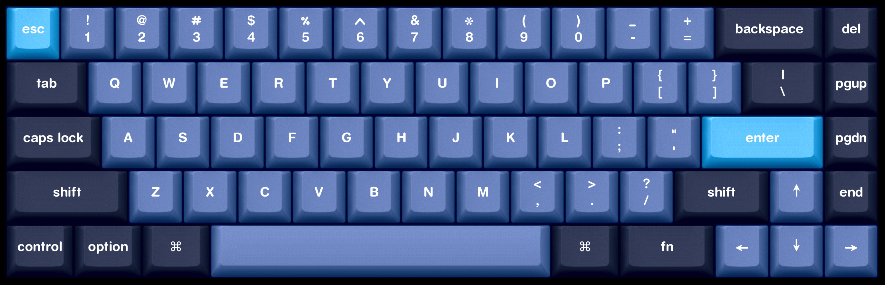
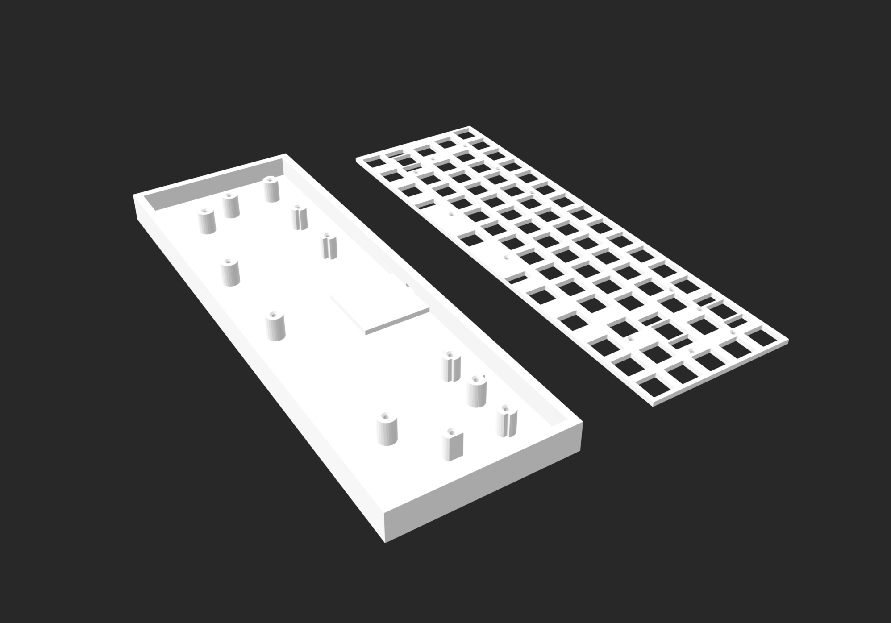

# CustomKeyboard V1 ( Hand Wired )

A 65% hand-wired mechanical keyboard with Mac-optimized layout.

## Specifications

| Feature       | Value                  |
|---------------|------------------------|
| Layout        | 65% (68 keys)          |
| MCU           | Arduino Pro Micro      |
| Connectivity  | USB-C                  |
| Firmware      | QMK                    |
| Assembly      | Hand-wired             |


## Features

- Mac layout with Command/Option keys
- Hand-wired matrix construction
- QMK support for keymap configuration
- Cross-platform compatibility (macOS, Windows, Linux)
- 3D printed case and plate

## Repository Structure
```
CustomKeyboard V1/
├── firmware/
│   └── qmk
├── hardware/
│   ├── CaseAndPlate3DModel.f3d
│   └── plate.dxf
├── img/
│   ├── CustomKeyboard3DModel.png
│   ├── CustomKeyboardDesign.png
│   ├── CustomKeyboardRender.png
│   └── CustomKeyboardWiring.png
├── JOURNAL.md
├── README.md
└── bom.csv
```

## Hand-Wiring Process

1. 3D print or laser cut switch plate
2. Install switches into plate
3. Wire matrix (rows and columns)
4. Solder diodes to switches
5. Connect matrix to microcontroller
6. Flash firmware and test
7. Install in case
